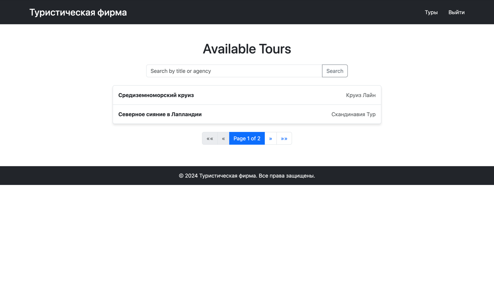
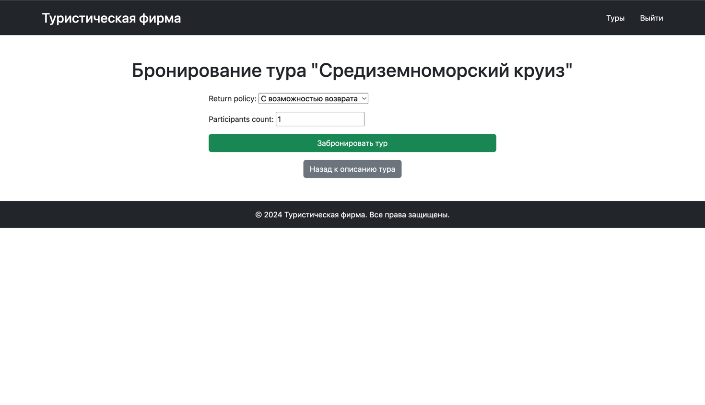
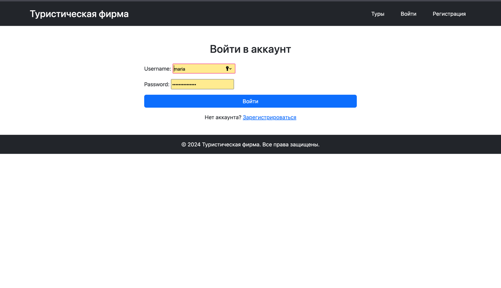
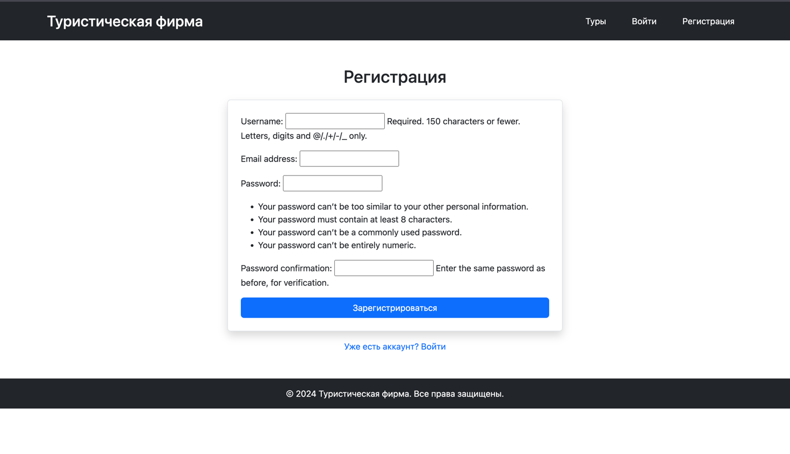

# Документация проекта Travel Tours

## Описание задачи

### Список туров туристической фирмы
Приложение **Travel Tours** предоставляет список туров туристической фирмы с возможностью регистрации пользователей, просмотра и бронирования туров, а также добавления отзывов. Администратор может подтверждать бронирования через Django Admin.

### Функциональные требования:
- **Регистрация пользователей**: Регистрация новых пользователей.
- **Просмотр и бронирование туров**: Пользователь может просматривать туры, резервировать, редактировать и удалять свои бронирования.
- **Добавление отзывов**: При добавлении отзыва к туру сохраняются даты тура, текст комментария, рейтинг (от 1 до 10) и информация о комментаторе.
- **Подтверждение бронирований**: Администратор должен иметь возможность подтвердить бронирование через Django Admin.
- **Проданные туры по странам**: Клиентская часть должна содержать таблицу, отображающую проданные туры по странам.


## Интерфейс









## Модели

Основные модели проекта `Travel Tours` находятся в `tours/models.py`:

- **Tour**: Хранит информацию о названии тура, турагентстве, описании, сроках проведения и условиях оплаты.
- **Reservation**: Связывает пользователей с конкретными турами, добавляет количество участников и политику возврата.
- **Review**: Позволяет пользователям оставлять отзывы о турах, включая текст, рейтинг и дату добавления отзыва.

Пример модели **Tour**:
```python
class Tour(models.Model):
    title = models.CharField(max_length=255)
    agency = models.ForeignKey(TourAgency, on_delete=models.CASCADE, related_name='tours')
    description = models.TextField()
    start_date = models.DateField()
    end_date = models.DateField()
    payment_terms = models.TextField()
    country = models.CharField(max_length=100)
```

---

## Аутентификация пользователей

1. **Регистрация** - Пользователи могут зарегистрироваться на странице `/signup/`, используя форму `UserCreationForm`.
2. **Вход/Выход** - Вход осуществляется через `/signin/`, а выход — через `/logout/`.

## Управление турами

**Список туров**  
Главная страница `/` отображает список туров с возможностью поиска по названию тура или названию агентства.

**Детали тура**  
Страница с информацией о туре доступна по адресу `/tour/<tour_id>/`, где отображаются основная информация, отзывы и текущие бронирования.

---

## Управление бронированиями

1. **Бронирование тура** — `/tour/<tour_id>/reserve/`. Пользователи могут забронировать тур, указав количество участников и политику возврата.
2. **Редактирование бронирования** — `/reservation/<reservation_id>/edit/`.
3. **Удаление бронирования** — POST-запрос по `/reservation/<reservation_id>/delete/`.

Пример кода для бронирования тура:
```python
@login_required
def reserve_tour(request, pk):
    tour = get_object_or_404(Tour, pk=pk)
    existing_reservation = Reservation.objects.filter(tour=tour, user=request.user).first()
    if existing_reservation:
        return redirect('edit_reservation', pk=existing_reservation.pk)
    if request.method == 'POST':
        form = ReservationForm(request.POST)
        if form.is_valid():
            reservation = form.save(commit=False)
            reservation.user = request.user
            reservation.tour = tour
            reservation.save()
            return redirect('tour_detail', pk=tour.pk)
    else:
        form = ReservationForm()
    return render(request, 'reserve_tour.html', {'form': form, 'tour': tour})
```

---

## Отзывы о турах

Пользователи могут добавлять отзывы на туры, включая:
- **Рейтинг** (от 1 до 10)
- **Текст отзыва**
- **Дата** и **информация о комментаторе**

Форма добавления отзыва доступна на странице тура по адресу `/tour/<tour_id>/add_review/`.

Пример:
```python
@login_required
def add_review(request, pk):
    tour = get_object_or_404(Tour, pk=pk)
    if request.method == 'POST':
        form = ReviewForm(request.POST)
        if form.is_valid():
            review = form.save(commit=False)
            review.user = request.user
            review.tour = tour
            review.save()
            return redirect('tour_detail', pk=tour.pk)
    else:
        form = ReviewForm()
    return render(request, 'add_review.html', {'form': form, 'tour': tour})
```

---

## Просмотр проданных туров

На странице `/sold-tours/` отображается таблица с проданными турами по странам, сгруппированными по количеству подтвержденных бронирований. Это позволяет пользователям видеть популярные туры.

Пример кода:
```python
def sold_tours_by_country(request):
    sold_tours = (
        Tour.objects.filter(reservations__is_confirmed=True)
        .values('country', 'title', 'agency__name')
        .annotate(reservations_count=Count('reservations'))
        .order_by('country')
    )
    return render(request, 'sold_tours.html', {'sold_tours': sold_tours})
```

---

## Дополнительные задания

### Меню
Меню на каждой странице включает ссылки на главную страницу, вход, регистрацию и список бронирований пользователя.

Пример меню в `base.html`:
```html
<nav class="navbar">
    <ul>
        <li><a href="">Туры</a></li>
        
            <li><a href="">Мои бронирования</a></li>
        
        
            <li>
                <form action="" method="post">
                    
                    <button type="submit">Выйти</button>
                </form>
            </li>
        
            <li><a href="">Войти</a></li>
            <li><a href="">Регистрация</a></li>
        
    </ul>
</nav>
```

### Пагинация страниц
Пагинация реализована в списках туров и бронирований, чтобы облегчить навигацию.

Пример шаблона пагинации:
```html
<div class="pagination">
    
        <a href="?page=1">&laquo; Первая</a>
        <a href="?page={{ page_obj.previous_page_number }}">Назад</a>
    
    <span>Страница {{ page_obj.number }} из {{ page_obj.paginator.num_pages }}</span>
    
        <a href="?page={{ page_obj.next_page_number }}">Вперед</a>
        <a href="?page={{ page_obj.paginator.num_pages }}">Последняя &raquo;</a>
    
</div>
```

### Поиск по объектам с пагинацией
Поиск и пагинация реализованы на страницах списка туров и бронирований пользователя.

Пример:
```python
class TourListView(ListView):
    model = Tour
    template_name = 'tour_list.html'
    paginate_by = 2

    def get_queryset(self):
        query = self.request.GET.get('q', '')
        queryset = Tour.objects.all()
        if query:
            queryset = queryset.filter(
                Q(title__icontains=query) | Q

(agency__name__icontains=query)
            )
        return queryset
```
