# Практическая работа №3.1: Django ORM - Запросы и их выполнение

## Описание

Эта работа направлена на освоение основных методов выполнения запросов в Django ORM, включая создание, фильтрацию, аннотирование и агрегацию данных. 
В рамках работы были созданы объекты для моделей, выполнены запросы для фильтрации данных, а также проведены аннотированные и агрегированные запросы для анализа данных.

## Цели работы

1. Ознакомиться с методами создания объектов через Django ORM.
2. Освоить выполнение базовых и сложных запросов с использованием Django ORM.
3. Научиться выполнять агрегированные и аннотированные запросы для анализа данных.
4. Закрепить знания по работе с полями Many-to-Many и связями между таблицами в Django.


### Задание 1: Создание объектов

1. Создать 6-7 автовладельцев (`CarOwner`), каждому из которых назначен пользователь (`User`).
2. Создать 5-6 автомобилей (`Car`) с различными характеристиками.
3. Назначить каждому владельцу удостоверение (`DrivingLicense`).
4. Присвоить каждому владельцу от 1 до 3 автомобилей через таблицу "владение" (`Ownership`).


```python
# Создание пользователей
user1 = User.objects.create_user(username="ivan", password="password123", passport_number="123456789", home_address="123 Main St", nationality="Russian")
# ...

# Создание владельцев автомобилей и связывание их с пользователями
owner1 = CarOwner.objects.create(user=user1, birth_date="1985-05-20")
# ...

# Создание автомобилей
car1 = Car.objects.create(registration_number="A123BC", make="Toyota", model="Camry", color="Red")
# ...

# Назначение водительских удостоверений для каждого владельца
license1 = DrivingLicense.objects.create(owner=owner1, license_number="L123456", license_type="B", issue_date=timezone.now())
# ...

# Создание записей владения автомобилями
Ownership.objects.create(car_owner=owner1, car=car1, start_date=timezone.make_aware(datetime(2022, 1, 1)), end_date=timezone.make_aware(datetime(2023, 1, 1)))
# ...
```


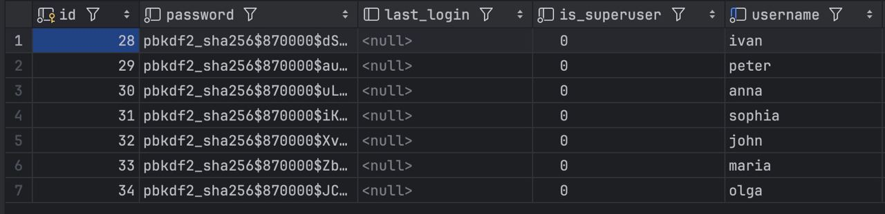
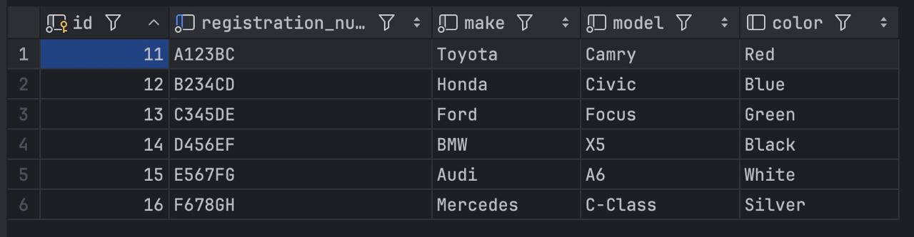
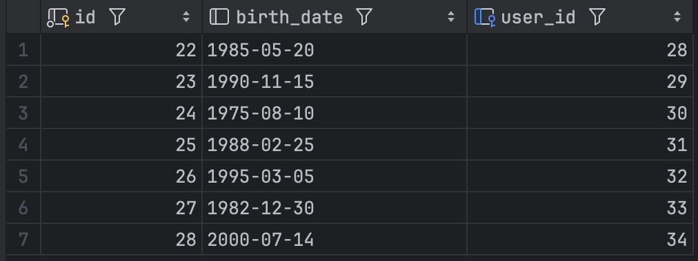
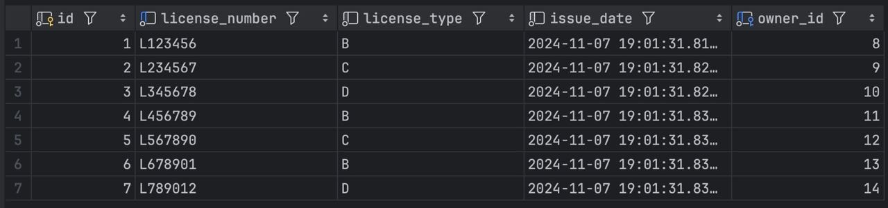
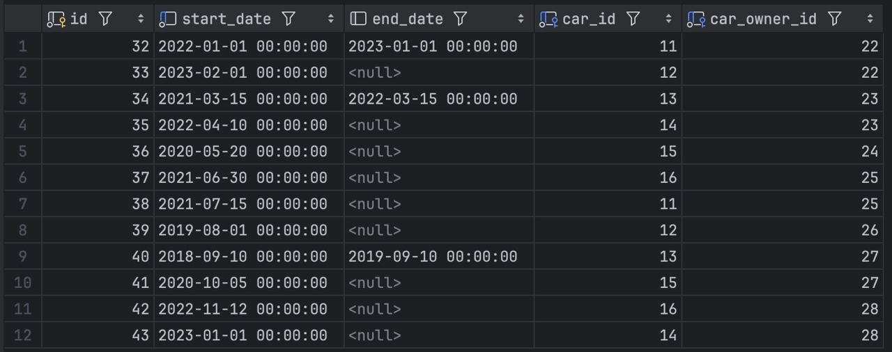


### Задание 2: Фильтрация данных

1. **Вывести все машины марки "Toyota".**
   

2. **Найти всех водителей с именем "maria".**
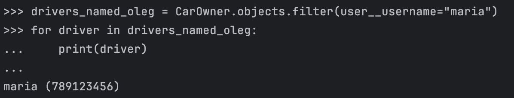

3. **Получить экземпляр удостоверения по id случайного владельца (2 запроса).**
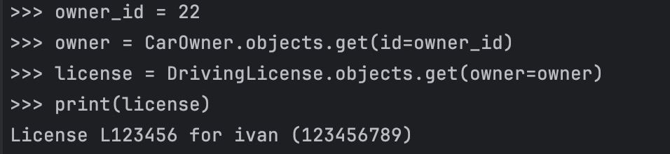

4. **Вывести всех владельцев красных машин.**
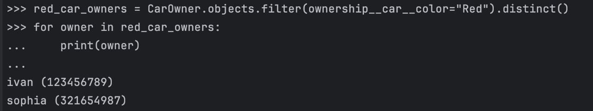

5. **Найти всех владельцев, чей год владения машиной начинается с 2021.**
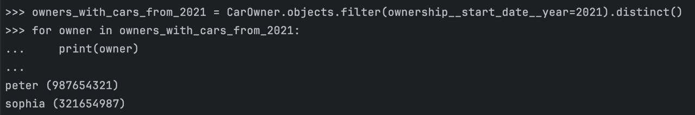

### Задание 3: Агрегация и аннотация запросов

1. **Вывести дату выдачи самого старшего водительского удостоверения.**
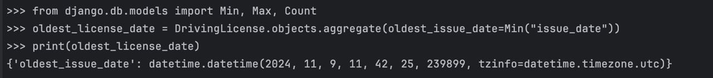

2. **Самая поздняя дата владения машиной.**


3. **Количество машин для каждого водителя.**
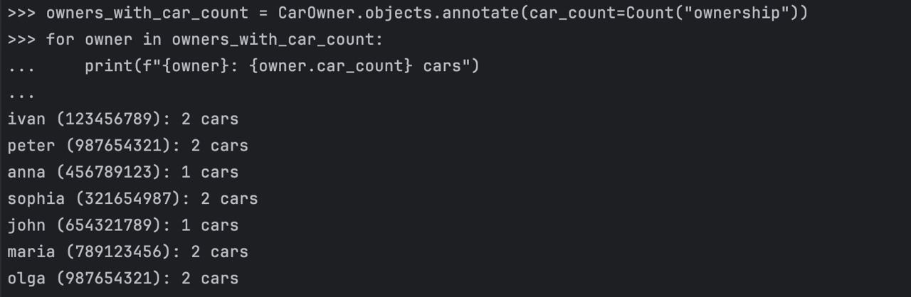

4. **Количество машин каждой марки.**
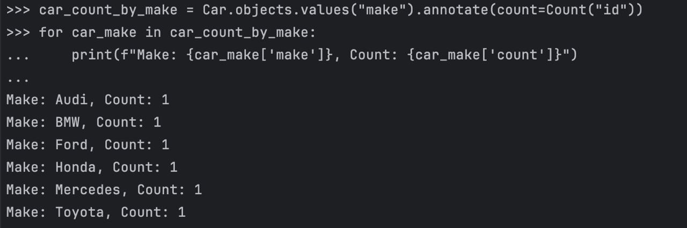

5. **Сортировка автовладельцев по дате выдачи удостоверения.**
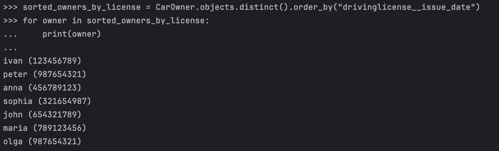

