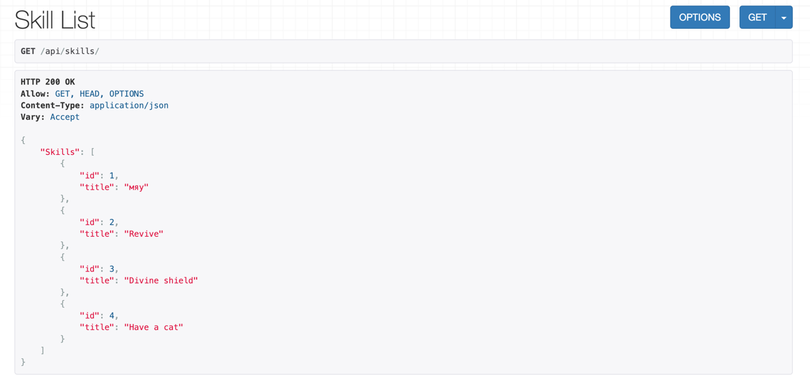

# Эндпоинты для работы с навыками

API предоставляет следующие возможности для управления навыками воинов.

## Эндпоинт для создания навыка

**URL** : `/api/skill/create/`  
**Метод** : `POST`

**Описание:** Создает новый навык и добавляет его в базу данных.

**Пример запроса:**
```json
{
  "skill": {"title": "Archery"}
}

```
Пример ответа:

```json
{
  "Success": "Skill 'Archery' created successfully."
}
```

## Эндпоинт для просмотра всех навыков
URL : /api/skills/
Метод : GET

Описание: Возвращает список всех существующих навыков.

Пример ответа:

HTTP 200 OK
Allow: GET, HEAD, OPTIONS
Content-Type: application/json
Vary: Accept

```json
{
    "Skills": [
        {
            "title": "мяу"
        },
        {
            "title": "Revive"
        },
        {
            "title": "Divine shield"
        },
        {
            "title": "Have a cat"
        },
        {
            "title": "Fireball"
        },
        {
            "title": "Swordsmanship"
        },
        {
            "title": "Archery"
        },
        {
            "title": "Stealth"
        }
    ]
}
```



---