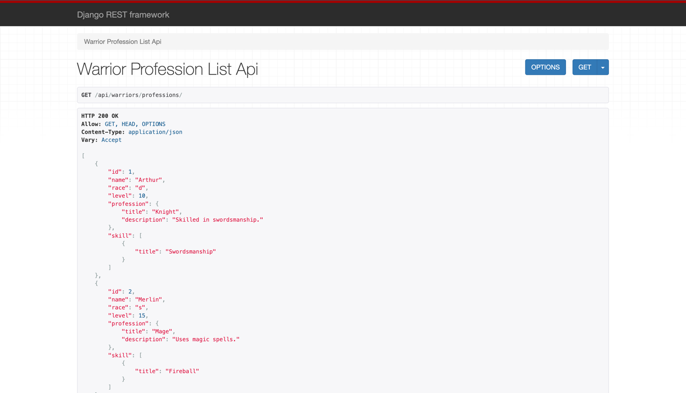
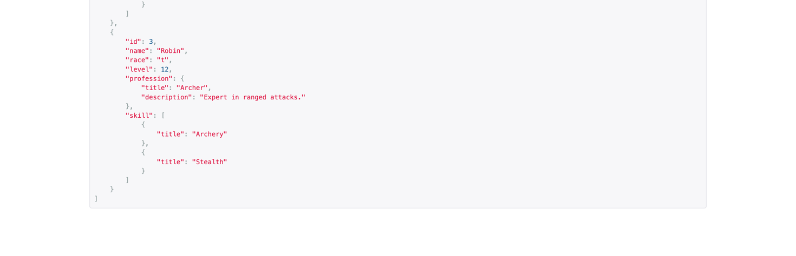
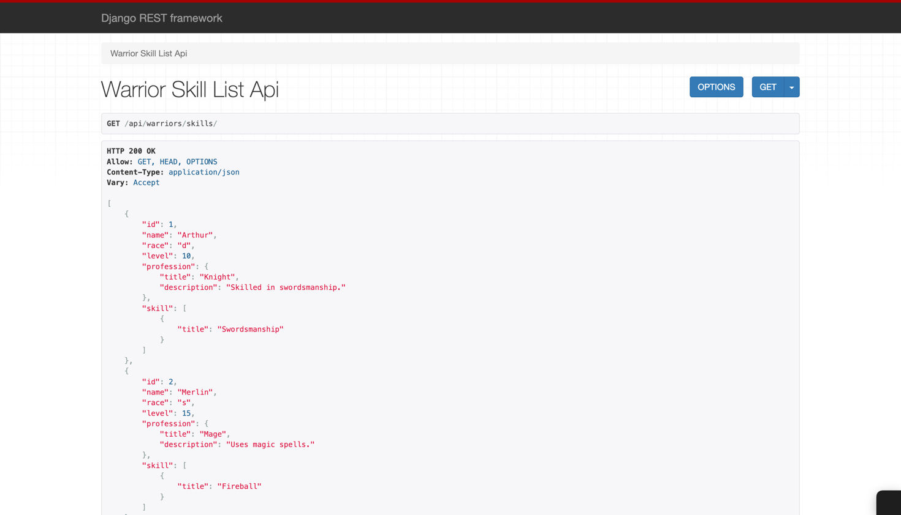
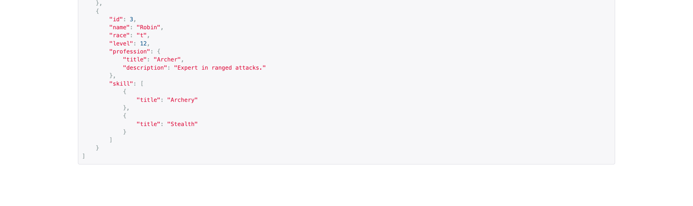
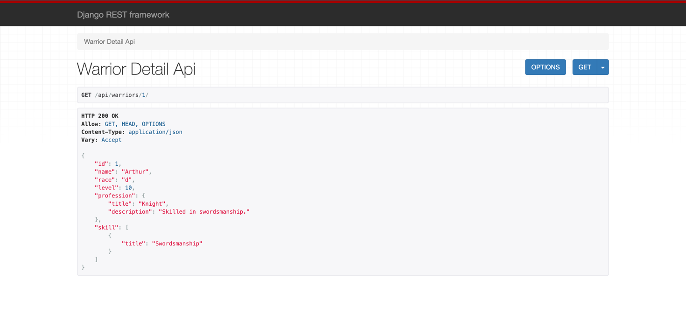
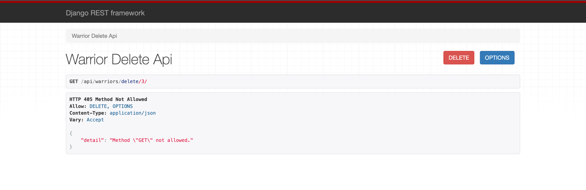
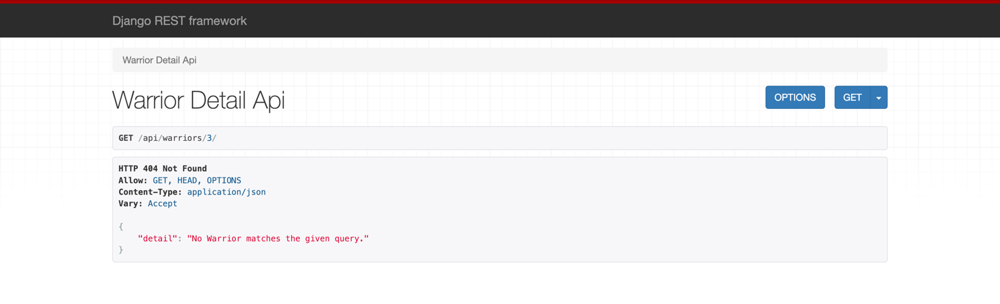
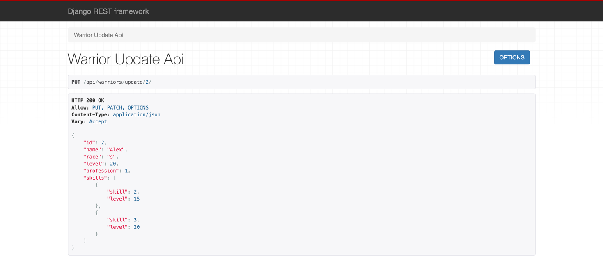

# Эндпоинты для работы с воинами

API предоставляет возможности для управления данными о воинах, включая их профессии и навыки.

## Полный список воинов и профессий

**URL** : `/api/warriors/professions`  
**Метод** : `GET`

**Описание:** Возвращает список всех воинов с информацией о их профессиях.

**Пример ответа:**
```json
    {
        "id": 1,
        "name": "Arthur",
        "race": "d",
        "level": 10,
        "profession": 2,
        "skills": [
            {
                "skill": 6,
                "level": 8
            }
        ]
    }
```

## Полный список воинов и навыков
URL : /api/warriors/skills/
Метод : GET

Описание: Возвращает список всех воинов и их навыков.

Пример ответа:
```json
    {
        "id": 1,
        "name": "Arthur",
        "race": "d",
        "level": 10,
        "profession": 2,
        "skills": [
            {
                "skill": 6,
                "level": 8
            }
        ]
    }
```

## Информация о конкретном воине
URL : /api/warriors/<id>/
Метод : GET

Описание: Возвращает полную информацию о конкретном воине по его id, включая его профессию и навыки.

Пример ответа:

```json
{
    "id": 1,
    "name": "Arthur",
    "race": "d",
    "level": 10,
    "profession": 2,
    "skills": [
        {
            "skill": 6,
            "level": 8
        }
    ]
}
```

## Удаление воина по ID
URL : /api/warriors/delete/<id>/
Метод : DELETE

Описание: Удаляет воина с указанным id из базы данных.


## Редактирование информации о воине
URL : /api/warriors/update/<id>/
Метод : PUT или PATCH

Описание: Обновляет информацию о воине с указанным id.

Пример запроса:
```json

{
    "name": "Воин Имя",
    "race": "d",        
    "level": 10,
    "profession": 1,
    "skills": [
        {
            "skill": 2,   
            "level": 3 
        },
        {
            "skill": 4,
            "level": 5
        }
    ]
}
```
Пример ответа:

HTTP 200 OK
Allow: PUT, PATCH, OPTIONS
Content-Type: application/json
Vary: Accept

```json
{
    "id": 4,
    "name": "Воин Имя",
    "race": "d",
    "level": 10,
    "profession": 1,
    "skills": [
        {
            "skill": 2,
            "level": 3
        },
        {
            "skill": 4,
            "level": 5
        }
    ]
}
```

## Скриншоты
1. Вывод полной информации о всех воинах и их профессиях (в одном запросе).


2. Вывод полной информации о всех воинах и их навыках (в одном запросе).


3. Вывод полной информации о конкретном воине по `id` с его профессиями и навыками.

4. Удаление воина по `id`.



5. Редактирование информации о воине.
