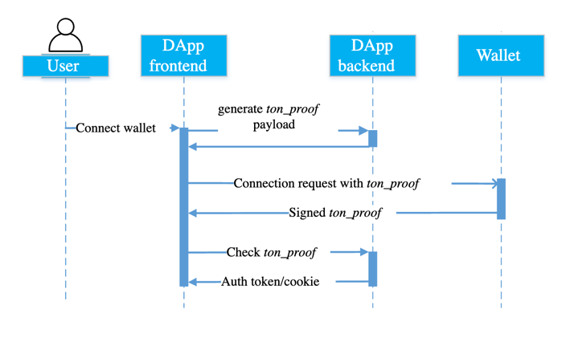

# Лабораторная работа №4: Разработка интерфейсов и интеграция с серверной частью

## Задача проекта

Разработать клиентские интерфейсы для работы с платформой предсказательного беттинга на базе блокчейна, настроить их взаимодействие с серверной частью.

## Используемые библиотеки и их назначение

### Для фронтенда:

- `@tonconnect/ui-react`: Управление подключением кошелька и интеграцией с блокчейном Ton.
- `react`, `react-router-dom`: Реализация пользовательского интерфейса с навигацией.
- `tailwindcss`: Современный CSS-фреймворк для стилизации компонентов.
- `react-select`: Улучшенные выпадающие списки для выбора торговых пар.
- `react-toastify`: Уведомления об ошибках, успехах и других событиях.

## Описание страниц интерфейса

### Главная страница

- **Описание**: Начальная страница, приветствующая пользователей и предоставляющая возможность подключения кошелька.
- **Основные функции**:
  - Приветственное сообщение и описание платформы.
  - Кнопка TonConnect для подключения кошелька.
  - Кнопки "Играть" и "Узнать больше" для навигации.


#### Логика реализации:

- **Подключение кошелька**: Используется `TonConnectButton` для взаимодействия с TonConnect.
- **Предзагрузка данных**: При помощи функций `getPairs()` и `fetchTime()` данные о парах и текущем времени блока загружаются и сохраняются в контексте через `setData`.
- **Обработка ошибок**: Ошибки подключения и загрузки данных отображаются в пользовательском интерфейсе.
- **Переходы**: Кнопки навигации управляют переходом на другие страницы с использованием `useNavigate`.

### Страница ставок

- **Описание**: Предоставляет интерфейс для выбора торговых пар и размещения ставок. При первом открытии пользователю показываются инструкции.
- **Основные функции**:
  - Выбор торговой пары.
  - Ввод предсказания (вектор цены/направления движения).
  - Подтверждение и отправка ставки.

  - на изображении: желтая стрелка - агрегированная ставка всех пользователей за прошлый блок, белая стрелка - ставка юзера за прошлый блок, ее же можно двигать, переключая моды осей, чтобы пояставить новую ставку.
#### Логика реализации:

- **Трёхмерный интерфейс ставок**: Пользователи видят трехмерный график, на котором агрегированные ставки всех участников за прошлый блок и своя ставка в виде стрелок на графике.
- **Обратная связь**: После отправки пользователь получает уведомление о статусе ставки.

### Страница управления кошельком

- **Описание**: Позволяет пользователю управлять балансом кошелька, включая пополнение и вывод средств.
- **Основные функции**:
  - Форма пополнения депозита через TON.
  - Форма вывода средств на кошелек юзера.
  - История транзакций с отображением их статуса.
  - История ставок с отображением их статуса.

#### Логика реализации:

- **Обработка пополнения**: Запросы на сервер для обработки депозитов и их конвертации в токены платформы.
- **Вывод средств**: Инициирование транзакции на указанный адрес (есть возможность сменить адрес).

### Страница балансов юзера

- **Описание**: Позволяет пользователю узнать его оставшийся депозит в игре, а также количество токенов находящихся 'at risk'. 
- **Основные функции**:
  - Отображение балансов юзера.
  - Кнопка для отключения кошелька.

#### Логика реализации:

- **Обработка пополнения**: Запросы на сервер для плучения балансов.
## Реализация авторизации
#### Диаграмма процесса авторизации


### Описание работы

Авторизация на платформе организована через интеграцию с блокчейном Ton и использованием механизма `ton_proof`. Весь процесс проходит несколько ключевых этапов:

1. **Подключение кошелька:**
   - Клиент отправляет запрос на сервер для генерации `payload`.
   - Пользователь подключает кошелёк через интерфейс TonConnect на клиенте, отправляя `payload` контракту кошелька.

2. **Подписание proof:**
   - Полученный `payload` подписывается приватным ключом кошелька пользователя.
   - Подписанный `proof` возвращается клиенту, а затем отправляется на сервер для проверки.

3. **Проверка proof:**
   - Сервер валидирует подпись, используя публичный ключ кошелька пользователя пользователя.
   - Если proof валиден, сервер генерирует пару токенов (access и refresh) и отправляет их клиенту.

4. **Хранение и использование токенов:**
   - Токены сохраняются в `localStorage` на клиенте и используются для авторизации запросов к API.
   - При истечении срока действия токенов клиент автоматически обновляет их через refresh-токен.

### Основные компоненты

#### 1. Фронтенд: Контекст авторизации

```tsx
import React, { createContext, useContext } from "react";
import { verifyPayload } from "../services/api";

const AuthContext = createContext();

export const AuthProvider = ({ children }) => {
  const loginWithProof = async (proofData) => {
    const { accessToken, refreshToken } = await verifyPayload(proofData);
    localStorage.setItem("authToken", accessToken);
    localStorage.setItem("refreshToken", refreshToken);
  };

  return (
    <AuthContext.Provider value={{ loginWithProof }}>{children}</AuthContext.Provider>
  );
};
```
**Объяснение:**
- Функция `loginWithProof` выполняет запрос на сервер для проверки `proof` и сохраняет токены в локальное хранилище.


### 2. Фронтенд: Интерсепторы для обновления токенов

**Интерсепторы** помогают автоматически обрабатывать запросы и ответы API. Это особенно полезно для управления обновлением токенов, когда срок действия текущего токена истекает.

#### Код настройки интерсепторов

1. **Создание экземпляра Axios:**
   ```javascript
   const apiClient = axios.create({
     baseURL: BASE_URL,
   });
   ```
   Здесь создаётся экземпляр `axios` с базовым URL, указывающим на API сервера. Все запросы будут направляться на этот адрес.

2. **Получение токенов из локального хранилища:**
   ```javascript
   function getAccessToken(): string | null {
     return localStorage.getItem("authToken");
   }

   function getRefreshToken(): string | null {
     return localStorage.getItem("refreshToken");
   }
   ```
   Эти функции возвращают токены из `localStorage`, если они существуют, или `null`, если токен отсутствует.

3. **Обновление токенов:**
   ```javascript
   const refreshAuthLogic = (failedRequest: AxiosError) =>
     apiClient
       .post<RefreshedTokens>(
         "/auth/refresh",
         {},
         {
           headers: {
             "X-Refresh-Token": getRefreshToken(),
           },
         }
       )
       .then((tokenRefreshResponse) => {
         localStorage.setItem("authToken", tokenRefreshResponse.data.accessToken);
         localStorage.setItem(
           "refreshToken",
           tokenRefreshResponse.data.refreshToken,
         );
         failedRequest.response!.config.headers["Authorization"] =
           "Bearer " + tokenRefreshResponse.data.accessToken;
         return Promise.resolve();
       });
   ```
   Когда запрос получает ошибку 401 (Unauthorized), интерсептор автоматически вызывает `/auth/refresh` для получения новых токенов.

4. **Интеграция с `axios-auth-refresh`:**
   ```javascript
   createAuthRefreshInterceptor(apiClient, refreshAuthLogic, {
     pauseInstanceWhileRefreshing: true,
   });
   ```
   Эта библиотека упрощает процесс обновления токенов, автоматически выполняя логику из `refreshAuthLogic` для каждого запроса с истёкшим токеном.

5. **Обработка запросов:**
   ```javascript
   apiClient.interceptors.request.use(
     (config) => {
       const token = getAccessToken();
       if (token) {
         config.headers.Authorization = `Bearer ${token}`;
       }
       return config;
     },
     (error) => Promise.reject(error),
   );
   ```
   Этот интерсептор добавляет заголовок `Authorization` ко всем запросам, если токен авторизации доступен.

### 3. Логика авторизации на главной странице

#### Код авторизации на `HomePage`

---

#### Взаимодействия с TonConnect на главной странице

```tsx
useEffect(() => {
    tonConnectUI.setConnectRequestParameters({ state: "loading" });
    const initTonConnect = async () => {
      try {
        const tonProofPayload = await getPayload();

        if (tonProofPayload) {
          tonConnectUI.setConnectRequestParameters({
            state: "ready",
            value: { tonProof: tonProofPayload.payload },
          });
        } else {
          tonConnectUI.setConnectRequestParameters(null);
        }
      } catch (error) {
        console.error("[HomePage]: Error during initialization:", error);
        setError(
          error instanceof Error ? error.message : "Unknown error occurred."
        );
      } finally {
        setLoading(false);
      }
    };

    initTonConnect();
  }, []);
```

**Объяснение логики:**
1. **Инициализация TonConnect:**
   - `tonConnectUI.setConnectRequestParameters` сначала устанавливает состояние как `loading`, что указывает на начальную загрузку.
   - Затем происходит асинхронный вызов функции `getPayload`, которая обращается к серверу для получения уникального `tonProofPayload`.

2. **Установка параметров подключения:**
   - Если `tonProofPayload` успешно получен, он передается в `tonConnectUI` для установки параметров подключения.
   - Если загрузка не удалась, параметры сбрасываются.

3. **Обработка ошибок:**
   - Ошибки при выполнении асинхронного кода обрабатываются и логируются. В случае ошибки пользователь получает сообщение.

4. **Завершение загрузки:**
   - Независимо от результата, состояние загрузки (`loading`) завершается.

---

#### 4.Запросы к бэкенду

Клиентское приложение взаимодействует с сервером через API, используя предварительно настроенный клиент Axios. Вот пример одного из запросов:

```typescript
export async function getUserBets(): Promise<UserBetsResponse> {
    try {
        const response = await apiClient.get<UserBetsResponse>("/user/bets");
        return response.data;
    } catch (error) {
        console.error("Error fetching user bets:", error);
        throw error;
    }
}
```

**Объяснение:**
1. **Назначение:** 
   Запрос получает список ставок пользователя, обращаясь к эндпоинту `/user/bets`.

2. **Обработка ошибок:**
   - Любая ошибка при выполнении запроса логируется.
   - Если сервер недоступен или вернул ошибку, она пробрасывается в вызывающий компонент.

3. **Типизация:**
   - Используется строгая типизация ответа с помощью `Promise<UserBetsResponse>`, что позволяет интегрироваться с остальными компонентами приложения.

---
### 5.Описание `PrefetchedData` и связанных запросов

---

`PrefetchedData` представляет собой контекст для управления ключевыми данными приложения, такими как список торговых пар, данные свечей, текущее время блока и выбранная пара. Этот подход улучшает производительность приложения за счет предварительной загрузки данных и их централизованного управления.

#### Как работает `PrefetchedData`

1. **Инициализация контекста:**
   Контекст создается для хранения данных, методов управления и состояния загрузки. Он включает:
   - `pairs` — список доступных торговых пар.
   - `candles` — данные свечей для выбранной пары.
   - `time` — оставшееся время текущего блока.
   - `selectedPair` — выбранная пользователем пара.
   - Методы для загрузки данных (`fetchCandlesForPair`) и выбора пары (`setSelectedPair`).

2. **Параллельные запросы в `useEffect`:**
   Внутри `useEffect` запускаются два параллельных запроса:
   - Для получения списка пар (`fetchPairs`).
   - Для получения времени блока (`fetchTimeData`).

3. **Реализация запросов:**

##### Загрузка пар (`fetchPairs`):
```tsx
const fetchPairs = async (): Promise<void> => {
  try {
    const pairsResponse = await getPairs();

    if (!pairsResponse || !Array.isArray(pairsResponse)) {
      console.warn("Данные пар невалидны, повторный запрос через 5 секунд...");
      setTimeout(fetchPairs, 5000);
      return;
    }

    const pairs = pairsResponse.map((pair) => ({
      value: pair.pair_id,
      label: pair.name,
    }));
    console.log("pairs", pairs);
    setData((prev) => ({ ...prev, pairs })); // Обновляем только пары
  } catch (error) {
    console.error("Ошибка при загрузке пар:", error);
    setTimeout(fetchPairs, 5000); // Повторяем запрос через 5 секунд
  }
};
```

**Логика:**
- Получает данные через API-запрос к `/pair`.
- Проверяет валидность ответа и преобразует его в формат, подходящий для использования в `react-select`.
- При ошибке повторяет запрос через 5 секунд.

##### Загрузка времени блока (`fetchTimeData`):
```tsx
const fetchTimeData = async (): Promise<void> => {
  try {
    const timeResponse = await fetchTime();

    if (!timeResponse || timeResponse.remaining_time_in_block === 0) {
      console.warn("Данные времени невалидны, повторный запрос через 5 секунд...");
      setTimeout(fetchTimeData, 5000);
      return;
    }
    console.log("time", timeResponse);
    setData((prev) => ({ ...prev, time: timeResponse.remaining_time_in_block })); // Обновляем только время
  } catch (error) {
    console.error("Ошибка при загрузке времени:", error);
    setTimeout(fetchTimeData, 5000); // Повторяем запрос через 5 секунд
  }
};
```

**Логика:**
- Получает время блока через API-запрос к `/chain/time`.
- Проверяет корректность данных времени и обновляет состояние.
- При ошибке также запускает повторный запрос.

---

#### Связь запросов с `PrefetchedData`

- **Инициализация данных:** При загрузке страницы в `useEffect` происходит вызов двух функций:
  ```tsx
  useEffect(() => {
    const fetchData = (): void => {
      fetchPairs();
      fetchTimeData();
    };
    fetchData(); // Запускаем первый цикл запросов
  }, [data.selectedPair]);
  ```
  Эти функции обновляют `pairs` и `time` внутри `PrefetchedData`, что делает их доступными для компонентов.

- **Обновление данных свечей:** Когда пользователь выбирает пару, `setSelectedPair` автоматически вызывает `fetchCandlesForPair`, чтобы обновить свечи для выбранной пары:
  ```tsx
  const setSelectedPair = (pair: PairOption | null) => {
    setData((prev) => ({ ...prev, selectedPair: pair }));
    if (pair?.value) {
      fetchCandlesForPair(pair.value);
    }
  };
  ```

##### Загрузка свечей (`fetchCandlesForPair`):
```tsx
const fetchCandlesForPair = async (pairId: string) => {
  setData((prev) => ({ ...prev, isLoading: true, error: null }));
  try {
    const candles = await fetchCandles(pairId);
    setData((prev) => ({ ...prev, candles, isLoading: false }));
    console.log("data.candles", candles);
  } catch (err) {
    console.error(`Ошибка при загрузке данных для пары ${pairId}:`, err);
    setData((prev) => ({
      ...prev,
      error: (err as Error).message || "Не удалось загрузить данные свечей",
      isLoading: false,
    }));
  }
};
```

**Логика:**
- Загружает данные свечей через API-запрос.
- Обновляет `candles` в `PrefetchedData`, что делает их доступными для визуализации.
